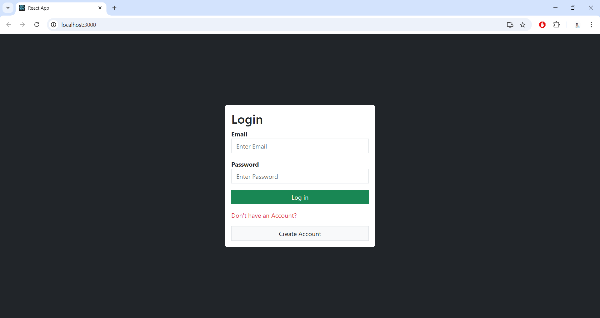
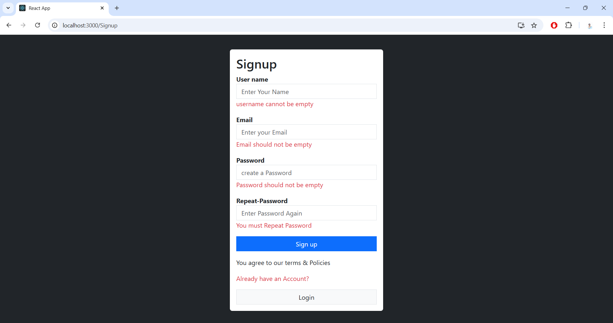
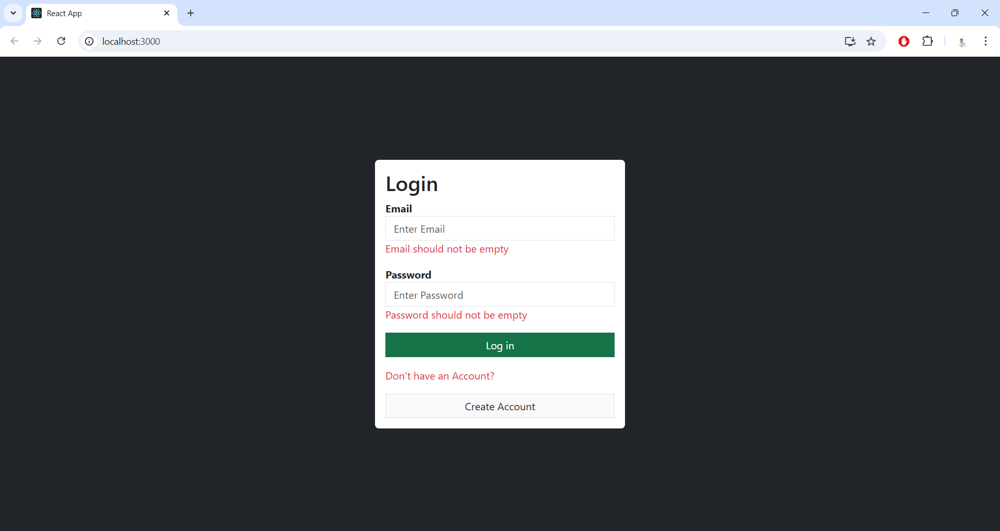

# React Login and Signup Page with Client-Side Validation

This is a **React-based frontend project** demonstrating a **Login** and **Signup** page with real-time **client-side validation**. 
It validates user inputs like email, password, and username to ensure they meet the required format.

---

## Features

- **Login and Signup Forms**: A user-friendly interface to log in or sign up.
- **Real-Time Validation**: Client-side validation for inputs such as:
  - Username requires at least 3 characters.
  - Password matching validation.
  - Required field validation.
  - Ensures the "Repeat Password" field matches the original password in the signup form.
- **Responsive Design**: Works seamlessly across different screen sizes.

---

## Screenshots

Here are some screenshots of the application:

### **Signup Page**


### **Login Page**


### **Signup Error 1**


### **Login Error 1**



You can find more screenshots in the **`Screenshots`** folder.

---

## Prerequisites

Before setting up the project, make sure you have the following installed:

1. **Node.js** (v22.12.0)
2. **npm**: Comes with installing Node.js.

To check if Node.js and npm are installed, run the following commands in your terminal:

```bash
node -v
npm -v 
```
---

## Setup Guide
Follow these steps to setup and run the project on your local machine.
### Step 1: Clone the Repository & change the directory
Open your terminal or command prompt (preferably in VS Code terminal) and run :
```bash
git clone https://github.com/MDAMMADHUSSAIN/Login-signup
cd Login-signup
cd frontend
```
---

### Step 2: Install Dependecies
Install all required Node.js dependencies by running : 
```bash
npm install
```
---

### Step 3: Start the Application
Start the development server using the following command :
```bash
npm start
```
Once the server starts successfully, you will see the following message in your terminal:
```bash
Compiled successfully!

You can now view the app in the browser.

Local: http://localhost:3000
```

---

### Step 4: Open the Application
- Open your browser.
- Visit http://localhost:3000.
- The Login and Signup pages will be displayed.

---

### Step 5: Test the Validation Features  
- **signup page:**
  - Username must have at least 3 characters.
  - Password must have at least 8 characters.
  - Repeat Password must match the original password.
  - Email format will be validated.

- **Login page:**
  - Verify basic form validation for email and password..


